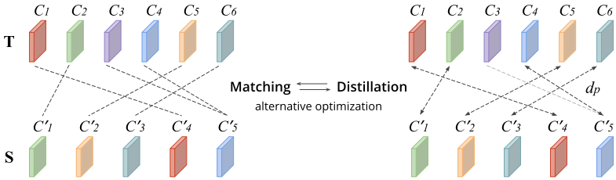
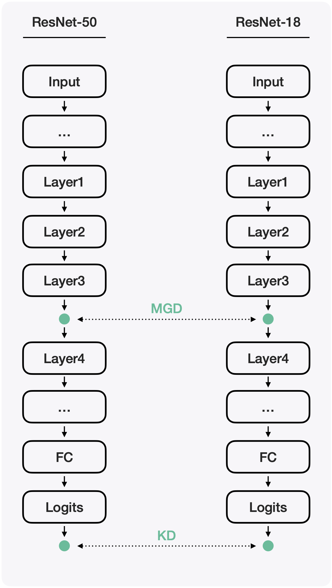

Matching Guided Distillation
===

> [**Project Webpage**](http://kaiyuyue.com/mgd) | [**Paper**](https://arxiv.org/abs/2008.09958) | [**Zhihu Blog [知乎]**](https://zhuanlan.zhihu.com/p/379219502)

## Updates

- July 28, 2021. [**MGD in Unsupervised Training**](./unsup).

## Introduction

This implementation is based on [the official PyTorch ImageNet training code](https://github.com/pytorch/examples/tree/master/imagenet), 
which supports two training modes [DataParallel](https://pytorch.org/docs/stable/generated/torch.nn.DataParallel.html#torch.nn.DataParallel) (DP) and [DistributedDataParallel](https://pytorch.org/docs/stable/distributed.html) (DDP).
MGD for object detection is also re-implemented in [Detectron2](https://github.com/facebookresearch/detectron2) as an external project.



Note: **T** : teacher feature tensors. **S** : student feature tensors. *dp* : distance function for distillation. *Ci*: i-th channel.

## BibTex

```BibTeX
@inproceedings{eccv20mgd,
    title     = {Matching Guided Distillation},
    author    = {Yue, Kaiyu and Deng, Jiangfan and Zhou, Feng},
    booktitle = {European Conference on Computer Vision (ECCV)},
    year      = {2020}
}
```

## Software Version Used for Paper

- Python - 3.7
- PyTorch - 1.5.0 with torchvision - 0.6.0
- Detectron2 Tree - [369a57d333](https://github.com/facebookresearch/detectron2/tree/369a57d333ff9c05c9dd42ab3c3d8156860dc710)

## Quick & Easy Start

We take using ResNet-50 to distill ResNet-18 as an example, as shown in the below figure.

<div align="center">
    
</div>

**Note**: models are from [torchvision](https://github.com/pytorch/vision/tree/master/torchvision/models).

### 0. Install Dependencies

Install OR-Tools by `pip install ortools`.

### 1. Expose Intermediate Features

The function exposes intermediate features and final output logits. The only thing to do is copy the original forward [context](https://github.com/pytorch/vision/blob/master/torchvision/models/resnet.py#L230-L246) and expose any tensors you want to work with for distillation. [Reference](./cls/models/resnet.py#L252-L273).
    
```python
def extract_feature(self, x, preReLU=False):
    ...

    feat3 = self.layer3(x) # we expose layer3 output

    x = self.layer4(feat3)

    ...

    if not preReLU:
        feat3 = F.relu(feat3)

    return [feat3], x
```

### 2. Expose BN

The function exposes BN layers before the distillation position. [Reference](./cls/models/resnet.py#L232-L247).

```python
def get_bn_before_relu(self):
    if isinstance(self.layer1[0], Bottleneck):
        bn3 = self.layer3[-1].bn3
    elif isinstance(self.layer1[0], BasicBlock):
        bn3 = self.layer3[-1].bn2
    else:
        print('ResNet unknown block error !!!')
        raise
    
    return [bn3]
```

### 3. Indicate Channel Number

The function tells MGD the channel number of the intermediate feature maps. [Reference](./cls/models/resnet.py#L249-L250).

```python
def get_channel_num(self):
    return [1024]
```

### 4. Build Model

```python
t_net = resnet50() # teacher model
s_net = resnet18() # student model

import mgd.builder
d_net = mgd.builder.MGDistiller(
    t_net,
    s_net,
    ignore_inds=[],
    reducer='amp',
    sync_bn=False,
    with_kd=True,
    preReLU=True,
    distributed=False, # DP mode: False | DDP mode: True
    det=False # work within Detectron2
)
```

### 5. Add MGD Steps In Training Procedure

[Reference](./cls/main_mgd.py#L519-L538).

```python
# init mgd params in the first start
mgd_update(train_loader, d_net)

# training loop
for epoch in range(total_epochs):

    # UPDATE_FREQ can be set by yourself
    if (epoch+1)%UPDATE_FREQ == 0:
        mgd_update(train_loader, d_net)
```

## MGD In Tasks

[Classification](./cls) | [Object Detecton](./d2) | [Unsupervised Training](./unsup).

## Acknowledgements

We learn and use some part of codes from following projects. We thank these excellent works:

* [A Comprehensive Overhaul of Feature Distillation](https://github.com/clovaai/overhaul-distillation), ICCV'19.
* [Detectron2](https://github.com/facebookresearch/detectron2). FAIR's next-generation platform for object detection and segmentation.

## License

MIT. See [LICENSE](./LICENSE) for details.
