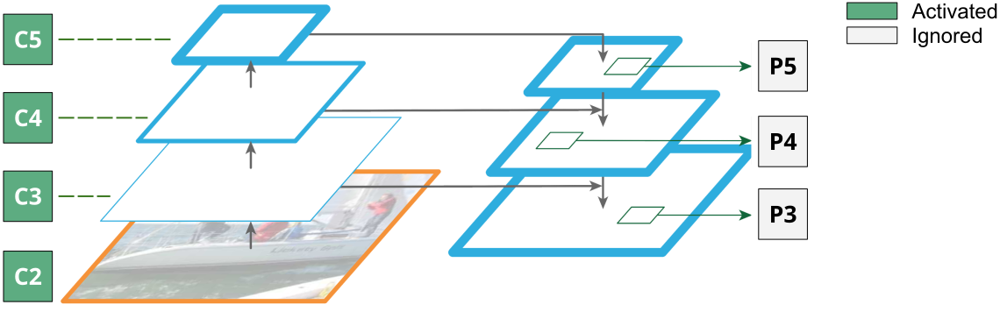

MGD in Detectron2
===

This `train_net.py` script reproduces MGD experiment of using RetinaNet-R50 to distill RetinaNet-R18 on COCO.

The results in paper were produced from the code written with [maskrcnn-benchmark](https://github.com/facebookresearch/maskrcnn-benchmark), which has been deprecated.
This is a re-implemented code with using Detectron2. 
The improvement margin brought by MGD here is slightly larger than that in paper.

## Instruction

* Install [Detectron2](https://github.com/facebookresearch/detectron2/blob/master/INSTALL.md) in this directory `./detectron2`

## Base Training

#### 1. Convert torchvision Pretrained Model to Detectron2

Since there is no ResNet-18 pretrained model released by MSRA, we use torchvision model here for model initialization.
Download [torchvision resnet models](https://github.com/pytorch/vision/blob/master/torchvision/models/resnet.py#L11-L16) and then use [detectron2/tools/convert-torchvision-to-d2.py](https://github.com/facebookresearch/detectron2/blob/master/tools/convert-torchvision-to-d2.py) to convert them into detectron2's format.

```bash
#!/usr/bin/env bash

# ResNet-50
python detectron2/tools/convert-torchvision-to-d2.py \
    resnet50-19c8e357.pth \
    r-50.pkl
    
# ResNet-18
python detectron2/tools/convert-torchvision-to-d2.py \
    resnet18-5c106cde.pth \
    r-18.pkl
```

#### 2. Train RetinaNet

To train the base RetinaNet-R50/R-18 and run

```bash
#!/usr/bin/env bash

DEPTH=50 # or 18

cp configs/retinanet_torchvision_R_${DEPTH}_FPN_1x.yaml detectron2/configs/COCO-Detection/
cd detectron2
python tools/train_net.py \
    --num-gpus 8 \
    --config-file configs/COCO-Detection/retinanet_torchvision_R_${DEPTH}_FPN_1x.yaml \
    MODEL.WEIGHTS r-${DEPTH}.pkl
```

#### 3. Results

| **model** | **lr sched** | **AP50** | **AP** | **AP75** | **model id** | **download** |
|:---:|:---:|:---:|:---:|:---:|:---:|:---:|
| [RetinaNet-R50](configs/retinanet_torchvision_R_50_FPN_1x.yaml) | 1x | 56.03 | 36.70 | 39.04 | 9db3bf173 | [`Google Drive`](https://drive.google.com/file/d/1BrYMN-UtEazO6k9t5sE-Hbc_oa64QeDU/view?usp=sharing) [`Baidu Pan`](https://pan.baidu.com/s/11dSSfj777PLPxtks2iErlA) [code: `kkap`] |
| [RetinaNet-R18](configs/retinanet_torchvision_R_18_FPN_1x.yaml) | 1x | 49.84 | 31.81 | 33.60 | - | - |

Note： 
* The torchvision pretrained models will produce slightly worse results than MSRA models. Refer to the [comments](https://github.com/facebookresearch/detectron2/blob/master/tools/convert-torchvision-to-d2.py#L27-L29).

## MGD Training

#### 1. Put Pretrained Models Together

We put two pretrained models together and save only one pkl file in detectron2's format for MGD training.

These two pretrained models are: 
* RetinaNet-R50 model produced by the [step-2 of base training](#2-train-retinanet). Its model id is 9db3bf173. It can be downloaded from the above results table.
* ResNet-18 model from torchvision, please follow the [step-1 of base training](#1-convert-torchvision-pretrained-model-to-detectron2) to download and convert it into `r-18.pkl`.

To merge teacher `model_9db3bf173.pth` and student `r-18.pkl` into one file `T50-S18.pkl`, run

```bash
#!/usr/bin/env bash
python scripts/merge-models-into-one.py \
    [path/to/retinanet-r50/base/model_9db3bf173.pth] \
    r-18.pkl \
    T50-S18.pkl
```

#### 2. Train with MGD

To distill RetinaNet-R18 by RetinaNet-R50 with MGD, run the following script

```bash
#!/usr/bin/env bash

# copy necessary files into detectron2
cp configs/* detectron2/configs/COCO-Detection/
cp d2/modeling/backbone/* detectron2/detectron2/modeling/backbone/
cp d2/modeling/meta_arch/* detectron2/detectron2/modeling/meta_arch/
cp d2/engine/* detectron2/detectron2/engine/
cp ../mgd/builder.py mgd/mgd.py

# start training
python train_net.py \
    --num-gpus 8 \
    --config-file detectron2/configs/Base-RetinaNet.yaml \
    MODEL.WEIGHTS T50-S18.pkl
```

#### 3. Evaluate Student Model

We need to split out the student model from checkpoint, for example the final saved checkpoint `./output/model_final.pth`. 
Run the following script:

```bash
#!/usr/bin/env bash
python scripts/convert-output-to-d2.py \
    ./output/model_final.pth \
    ./output/model_final.pkl \
    # --eval-teacher # uncomment this line if you would like to check teacher performance
```

If you would like to convert once for all the checkpoints, this script may help:

<details>
  <summary>Script for processing all checkpoints</summary>

```bash
#!/usr/bin/env bash
OUTPUT_DIR=output
for out in $(ls $OUTPUT_DIR); do
    if [[ $out == *"pth"* ]]; then
        old=$out
        new="${out/pth/pkl}"
        echo $old "->" $new
        python scripts/convert-output-to-d2.py \
            ./output/$old \
            ./output/$new \
            # --eval-teacher # uncomment this line if you would like to check teacher performance
    fi
done
```
</details>

To do evaluation for student model and run

```bash
#!/usr/bin/env bash

# copy necessary files into detectron2
cp configs/* detectron2/configs/COCO-Detection/
cp d2/modeling/backbone/* detectron2/detectron2/modeling/backbone/
cp d2/modeling/meta_arch/* detectron2/detectron2/modeling/meta_arch/
cp d2/engine/* detectron2/detectron2/engine/
cp ../mgd/builder.py mgd/mgd.py

# evaluate student model distilled by MGD
python train_net.py \
    --num-gpus 8 \
    --eval-only \
    --config-file detectron2/configs/Base-RetinaNet.yaml \
    MODEL.WEIGHTS ./output/model_final.pkl
```

#### 4. Results

| **model** | **method** | **lr sched** | **AP50** | **AP** | **AP75** | **model id** | **download** |
|:---:|:---|:---:|:---:|:---:|:---:|:---:|:---:|
| [RetinaNet-R50](configs/retinanet_torchvision_R_50_FPN_1x.yaml) | Teacher | 1x | 56.03 | 36.70 | 39.04 | 9db3bf173 | [`Google Drive`](https://drive.google.com/file/d/1BrYMN-UtEazO6k9t5sE-Hbc_oa64QeDU/view?usp=sharing) [`Baidu Pan`](https://pan.baidu.com/s/11dSSfj777PLPxtks2iErlA) [code: `kkap`] |
| [RetinaNet-R18](configs/retinanet_torchvision_R_18_FPN_1x.yaml) | Student | 1x | 49.84 | 31.81 | 33.60 | - | - |
| [mgd/config.py](mgd/config.py) | MGD - AMP | 1x | 51.09 | 32.47 | 34.29 | 73c2534e9 | [`Google Drive`](https://drive.google.com/file/d/1rs0YRtfW-PMU4eY7P5tm9Qhwm6kdCEqX/view?usp=sharing) [`Baidu Pan`](https://pan.baidu.com/s/10VuTcLUMhh5njAN627OlMg) [code: `n2te`] |

## Training Notes

#### 1. Distillation Positions

<div align="center">
    
</div>

The above figure demonstrates distillation positions for the detection model with [FPN](https://arxiv.org/abs/1612.03144) architecture.
In FPN, the intermediate output features have their own specific names, as shown in figure, which are `C2, C3, C4, C5` in bottom-up pathway and `P5, P4, P3` in top-down pathway.
Under the same experimental setting with classification task, we use `C2, C3, C4, C5` from the resnet backbone.
This is why we set `cfg.MODEL.BACKBONE.FREEZE_AT = 1` [here](mgd/config.py#L15) for student model.
Using default value may produce worse results.
Here is the comparison.

| **model** | **method** | **FREEZE_AT** | **cfg.MGD.IGNORE_INDS** | **AP** |
|:---:|:---:|:---:|:---|:---:|
| RetinaNet-R18 | [MGD - AMP](mgd/config.py) | 1 | [4, 5, 6, 7, 8]    | 32.47 |
|               |                            | 2 | [0, 4, 5, 6, 7, 8] | 32.28 |

#### 2. Norm Layers

We enable norm layers to be trained in the last block of each stage in resnet backbone for student.
Since we use the feature maps before ReLU to distill student and calculate the [loss margins](../mgd/builder.py#L87-L94) using the affine parameters of teacher norm layers,
we want to let student not only learns better feature maps from teacher, but also needs to learn the better batched statistics and affine parameters from teacher norm layers.

In default [setting](mgd/config.py#L28), we use `torch.nn.GroupNorm` for MGD training due to the small batch size. 
If one would like to use Sync version norm layer, please set `cfg.MGD.SYNC_BN = True`.
Same as classification, this is only for experimental and research purpose.

#### 3. Loss Factors

Since the spatial shape changes during training, the [loss factors](../mgd/builder.py#L82-L85) may be a little tricky to set.
We follow a simple rule to choose them - make each stage distillation loss value into `0.0x` after dividing its [loss factor](../mgd/builder.py#L82-L85) and [batch size](train_net.py#L110) at the beginning of training.
Hope this tip may be helpful in your own project task.

## Known Issues

If using PyTorch 1.4 to run the Detectron2, you may encounter the problem of

```bash
RuntimeError:
No such operator torchvision::nms
```

According to its related [issue1](https://github.com/pytorch/vision/issues/1405) and [issue2](https://github.com/facebookresearch/detectron2/issues/94), there are two solutions:

- Upgrade your PyTorch and torchvision together to avoid using `torchvision==0.5.0`.
- Manually `pip uninstall torchvision` and download source code from [releases/tag/v0.5.0](https://github.com/pytorch/vision/releases/tag/v0.5.0) and then compile it by yourself. 